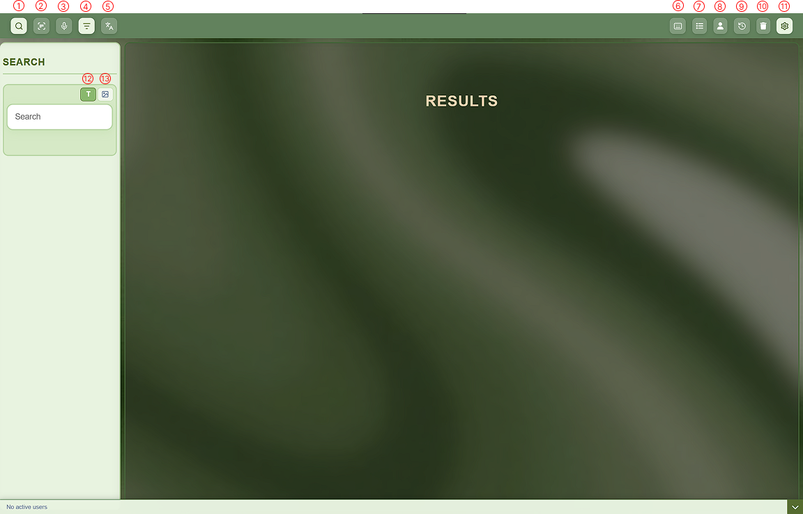
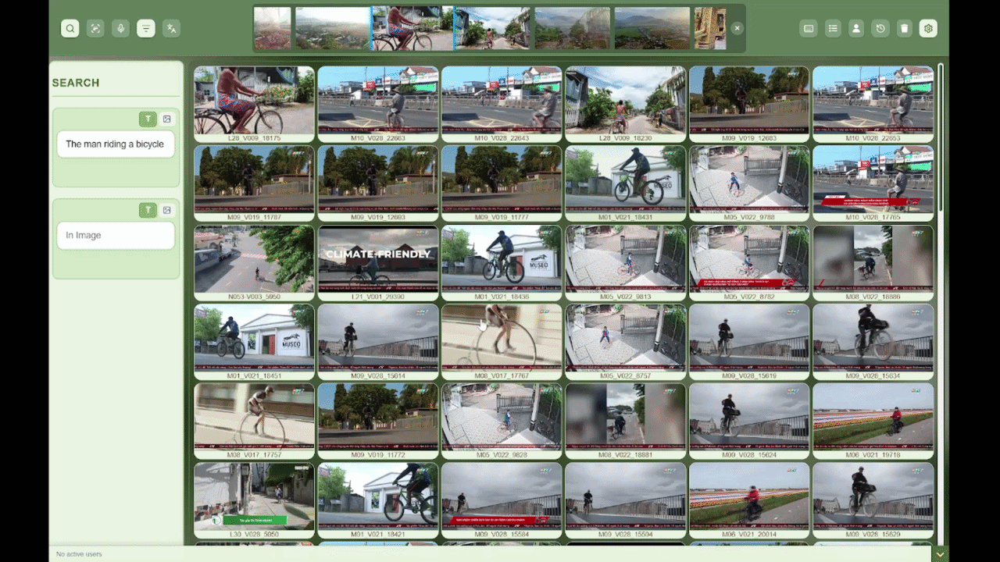
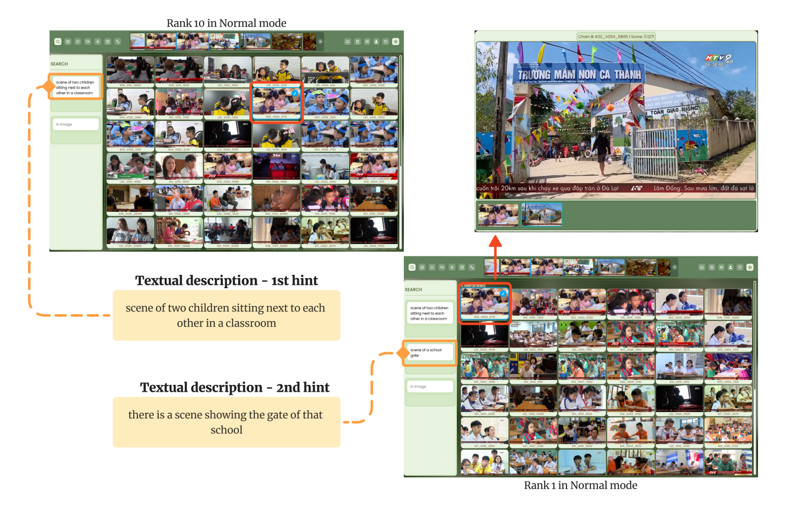
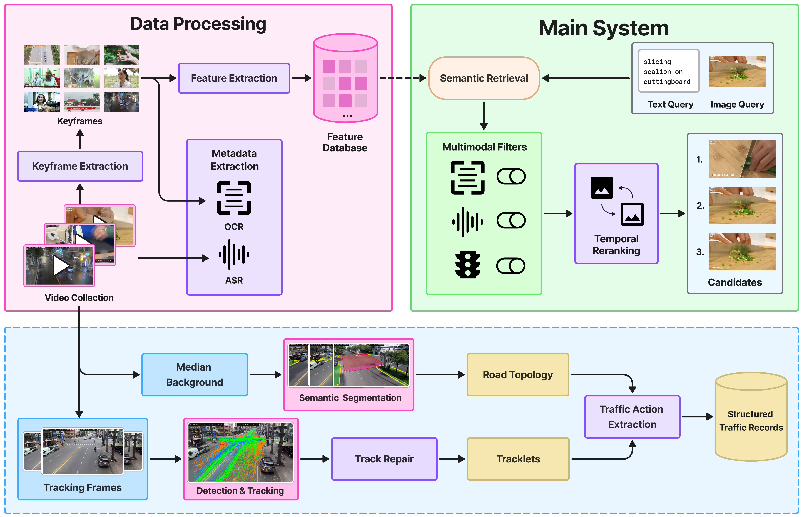

# Large-Scale Multimodal Video Retrieval System with Temporal Reasoning & Topology-Aware Motion

<div align="center">

[](https://doi.org/10.1007/978-981-92-2590-3_44)
[](#7-research-foundations--publications)
[-gold?style=for-the-badge)](https://github.com/longtraan06/Multimodal-Video-Retrieval-System)
[](https://github.com/longtraan06/Multimodal-Video-Retrieval-System)
[](https://github.com/longtraan06/Multimodal-Video-Retrieval-System)

[](https://fastapi.tiangolo.com/)
[](https://milvus.io/)
[](https://redis.io/)
[](https://nginx.org/)
[](https://www.docker.com/)
[](https://www.python.org/)

**A high-throughput, research-backed multimodal video retrieval platform uniting Multi-Vision-Language backbones, MLLM sliding-window event reasoning, global temporal sequence relinking, and topology-aware motion filtering.**

</div>

---

## Table of Contents

- [1. Executive Summary](#1-executive-summary)
- [2. System Capabilities & Interactive Demos](#2-system-capabilities--interactive-demos)
  - [2.1. Real-Time Multimodal Semantic Search](#21-real-time-multimodal-semantic-search)
  - [2.2. Operator Control Console & Feature Matrix](#22-operator-control-console--feature-matrix)
  - [2.3. Temporal Keyframe Inspection & Context Scrubbing](#23-temporal-keyframe-inspection--context-scrubbing)
  - [2.4. Frame-Accurate Video Playback Verification](#24-frame-accurate-video-playback-verification)
  - [2.5. Multi-Event Sequence Retrieval Demonstration](#25-multi-event-sequence-retrieval-demonstration)
- [3. System Architecture](#3-system-architecture)
- [4. Core Algorithmic Innovations](#4-core-algorithmic-innovations)
  - [4.1. Multi-Backbone Visual Ensemble](#41-multi-backbone-visual-ensemble)
  - [4.2. MLLM-Guided Sliding-Window Event Capturing](#42-mllm-guided-sliding-window-event-capturing)
  - [4.3. Global Temporal Reranking & Sequence Relinking Formulation](#43-global-temporal-reranking--sequence-relinking-formulation)
  - [4.4. Topology-Aware Tracklet Filtering (Traffic Retrieval)](#44-topology-aware-tracklet-filtering-traffic-retrieval)
  - [4.5. Composed Image Retrieval (CIR)](#45-composed-image-retrieval-cir)
  - [4.6. Vietnamese-Adapted Multimodal OCR & ASR](#46-vietnamese-adapted-multimodal-ocr--asr)
- [5. High-Performance Serving & Engineering](#5-high-performance-serving--engineering)
- [6. Evaluation & Benchmarks](#6-evaluation--benchmarks)
  - [6.1. Competition Results (HCM AI Challenge)](#61-competition-results)
  - [6.2. Traffic Maneuver Retrieval Ablation](#62-traffic-maneuver-retrieval-ablation)
- [7. Research Foundations & Publications](#7-research-foundations--publications)
- [8. Complete Tech Stack](#8-complete-tech-stack)
- [9. Author & Engineering Credits](#9-author--engineering-credits)

---

<a id="1-executive-summary"></a>
## 1. Executive Summary

This project is an end-to-end, large-scale multimodal video retrieval platform designed to search, locate, and verify exact moments and complex temporal actions across massive video archives in sub-second response times.

As the **Full-stack AI Retrieval System Engineer**, I owned the entire lifecycle development of the platform—encompassing the web dashboard UI/UX, backend service APIs, distributed vector search pipelines, multi-layer caching, static asset streaming, and end-to-end deployment workflows.

### Project Highlights & Engineering Scope

- **Large-Scale Data Corpus:** Ingested and indexed over **325 hours of continuous video (1,487 video files)**, applying intelligent shot boundary detection and intra-shot deduplication to curate **1,196,413 searchable keyframes**.
- **Unified Multimodal Pipeline:** Built natural-language-to-frame retrieval combining **Tri-Model visual ensembles (SigLIP 2, FG-CLIP 2, MetaCLIP 2)** with multimodal preprocessing—incorporating Multimodal LLM (MLLM) event descriptions, Vietnamese scene-text OCR, speech ASR, and vehicle tracklet motion reasoning.
- **Novel Temporal Event Reasoning:** Developed a **Global Temporal Reranking** engine capable of understanding sequential action narratives across continuous video timelines (e.g., matching a sequence of chronological actions across different shots).
- **Sub-Second Serving Latency:** Architected a high-throughput serving stack powered by **FastAPI**, **Milvus Standalone**, **Redis in-memory caching & session rollback**, and **Nginx static delivery**, achieving steady **0.1s – 0.3s retrieval latency** across more than 1.19 million dense vectors.
- **Battle-Tested Under Pressure:** Evaluated in the **Ho Chi Minh City AI Challenge (HCMAI)** under team **LunchRetrieval**, securing **Top 3 Finalist honors among 400+ competitive teams nationwide**, maintaining over **94%–96% accuracy** and 100% operational uptime throughout live evaluation rounds.

> **Architecture & Security Note:** Due to organizational policies and competition confidentiality agreements, the production codebase is retained as proprietary. This repository serves as a technical showcase documenting the architectural design, algorithmic methodologies, low-latency engineering optimizations, and operator UI/UX workflows to facilitate technical review and evaluation.

---

<a id="2-system-capabilities--interactive-demos"></a>
## 2. System Capabilities & Interactive Demos

The system was engineered from the ground up for high-tempo search operations, giving operators immediate visual and auditory verification mechanisms across 1.19M+ frames.

<a id="21-real-time-multimodal-semantic-search"></a>
### 2.1. Real-Time Multimodal Semantic Search

The search engine executes sub-second queries (0.1s - 0.3s) over 1,196,413 keyframes, rendering instant 6-column result grids with synchronized previews.

<div align="center">
  
  <p><i>Figure 1: Live semantic retrieval executing under 0.3s with instant visual feedback and dynamic modal inspection.</i></p>
</div>

---

<a id="22-operator-control-console--feature-matrix"></a>
### 2.2. Operator Control Console & Feature Matrix

The user interface balances deep multimodal filtering control with strict keyboard ergonomics, enabling operators to formulate complex multi-modal queries without touching a mouse.

<div align="center">
  
  <p><i>Figure 2: Fully annotated operator control center with numbered control callouts.</i></p>
</div>

| ID | Control / Feature | Operational Description & Engineering Utility |
| :---: | :--- | :--- |
| **(1)** | **Default Search Mode** | Standard visual-semantic search querying fused multi-backbone vector indices. |
| **(2)** | **OCR Filter Mode** | Fuses vector similarity with exact/fuzzy regex matches on AzaleaOCR text layers. |
| **(3)** | **ASR Filter Mode** | Multi-mode speech filtering: keyword search or dense embedding match against audio transcripts. |
| **(4)** | **Video Exclusion Filter** | Blacklists non-relevant video IDs or noise cameras from candidate pools dynamically. |
| **(5)** | **Multilingual Translator** | On-the-fly cross-lingual query translation from Vietnamese into model-compatible English. |
| **(6)** | **Hotkeys Cheatsheet** | Complete list of keyboard shortcuts for hands-on-keyboard rapid tagging, navigation, and submission. |
| **(7)** | **Video Grouping Mode** | Groups retrieved candidate keyframes by Video ID to inspect event clusters effortlessly. |
| **(8)** | **Teamwork Mode Switch** | Toggles between isolated operator mode and WebSocket-synchronized multi-user collaboration. |
| **(9)** | **Query Session History** | Chronological timeline of all executed queries in the session with instant recall capability. |
| **(10)** | **Noise & Garbage Frame Bin** | Visual K-Means cluster manager allowing 1-click exclusion of TV logos, anchor shots, and studio noise. |
| **(11)** | **Custom System Settings** | Runtime selection of active models (SigLIP2, FG-CLIP2, MetaCLIP2), reranker weights, and serving modes. |
| **(12)** | **Text Search Input Tab** | Multimodal query builder supporting natural language text and multi-event temporal chains. |
| **(13)** | **Image Similarity Search Tab** | Composed and reverse image retrieval (CIR) using uploaded or pinned reference keyframes. |

---

<a id="23-temporal-keyframe-inspection--context-scrubbing"></a>
### 2.3. Temporal Keyframe Inspection & Context Scrubbing

Clicking any candidate keyframe opens the interactive **Keyframe Inspection Modal**, allowing operators to scrub contiguous neighboring frames before and after the hit timestamp without loading the entire video stream.

The modal provides **synchronized multimodal evidence inspection**:
- **Frame-Level OCR Recognition:** Dynamically displays on-screen scene text extracted for each inspected frame in real time.
- **Temporally Aligned ASR Transcripts:** Directly streams and displays the corresponding spoken dialogue transcripts for the exact time window in which the frame resides.

This tight visual-lexical-audio alignment enables operators to verify the semantic context of candidate scenes within seconds.

<div align="center">
  
  <p><i>Figure 3: Keyframe modal workflow — scrubbing contiguous timeline frames with synchronized frame-level OCR text inspection and time-aligned ASR audio transcripts.</i></p>
</div>

---

<a id="24-frame-accurate-video-playback-verification"></a>
### 2.4. Frame-Accurate Video Playback Verification

For fine-grained event confirmation, operators can transition directly into the **Video Playback Modal**, automatically seeking to the millisecond-accurate timestamp of the selected keyframe:
- **Interactive Timeline Thumbnail Strip:** A live visual preview scrubber renders real frame thumbnails directly beneath the player timeline, making fine-grained forward and backward scrubbing intuitive.
- **Synchronized Video Transcript Stream:** Displays the continuous, time-indexed speech transcript corresponding to the current playback position in real time.
- **In-Transcript Keyword Search:** Features an integrated keyword search bar within the transcript pane, allowing operators to query spoken terms and automatically jump playback straight to the exact dialogue timestamp.

<div align="center">
  
  <p><i>Figure 4: Direct in-modal video playback — featuring timeline thumbnail scrubbing, live synchronized transcripts, and in-transcript keyword search for instant timestamp navigation.</i></p>
</div>

---

<a id="25-multi-event-sequence-retrieval-demonstration"></a>
### 2.5. Multi-Event Sequence Retrieval Demonstration

When a query contains sequential actions across time, the system uses temporal linking to promote coherent narratives over isolated frame matches.

<div align="center">
  
  <p><i>Figure 5: Real-world impact of Temporal Reranking — Enforcing chronological coherence across sequential query hints promotes the true target sequence from <b>Rank 10</b> up to <b>Rank 1</b>.</i></p>
</div>

---

<a id="3-system-architecture"></a>
## 3. System Architecture

The platform follows a decoupled, modular architecture structured into three complementary operational domains:
1. **Offline Data Processing & Multimodal Enrichment Pipeline** (keyframe extraction, feature database, OCR, and ASR).
2. **Online Main Retrieval System** (multi-backbone semantic search, dynamic multimodal filters, and temporal reranking).
3. **Topology-Aware Traffic Tracklet Pipeline** (median background modeling, semantic road segmentation, ByteTrack tracking, and structured maneuver records).

<div align="center">
  
  <p><i>Figure 6: End-to-end system architecture — integrating offline Data Processing, online Main System serving, and the specialized Topology-Aware Traffic Tracklet pipeline.</i></p>
</div>

---

<a id="4-core-algorithmic-innovations"></a>
## 4. Core Algorithmic Innovations

<a id="41-multi-backbone-visual-ensemble"></a>
### 4.1. Multi-Backbone Visual Ensemble
To overcome single-encoder perceptual blind spots, candidate embeddings are queried across an ensemble:
- **SigLIP 2 (`so400m`, `large`, `giant`):** Primary vision-language backbone trained with sigmoid loss for exceptional zero-shot text-image classification.
- **BEiT-3 & MetaCLIP 2:** Complementary multi-modal alignment backbones that stabilize representation against visual hallucinations.
- **FG-CLIP 2:** Captures fine-grained object interactions, localized spatial features, and small-scale targets.
- **Reciprocal Rank Fusion (RRF):** Merges candidate lists dynamically across backbones.

---

<a id="42-mllm-guided-sliding-window-event-capturing"></a>
### 4.2. MLLM-Guided Sliding-Window Event Capturing
Instead of evaluating keyframes in isolation, the ingestion pipeline deploys a **10-second sliding window with 2-second overlap** evaluated by **Gemini-2.0-Flash**:
- Captures subtle non-textual dynamic cues: gestures, evolving movements, and multi-actor interactions.
- Produces dense, chronologically grounded event descriptions that serve as search anchors, bridging the semantic gap between static frames and full video context.

---

<a id="43-global-temporal-reranking--sequence-relinking-formulation"></a>
### 4.3. Global Temporal Reranking & Sequence Relinking Formulation

When querying consecutive actions (e.g., `Event A: "open door"` &rarr; `Event B: "walk out"` &rarr; `Event C: "drive away"`), standard beam search or additive scoring often yields disjointed, temporally inconsistent frames. Our **Global Temporal Reranker** resolves this mathematically:

#### Formalization
Let candidate hit sets for neighbor queries $X \rightarrow Y$ within the same video be $(t_{i}^{X}, s_{i}^{X})$ and $(t_{j}^{Y}, s_{j}^{Y})$. We compute temporal distance and blended visual similarity:

$$
D_{ij}^{XY} = |t_{i}^{X} - t_{j}^{Y}|, \quad B_{ij}^{XY} = w_{A} s_{i}^{X} + (1 - w_{A}) s_{j}^{Y}
$$

A distance penalty function $\phi(d)$ enforces narrative continuity:

$$
\phi_{\exp}(d) = 1 - e^{-\gamma d / \alpha}, \quad \text{or} \quad \phi_{\text{sqrt}}(d) = \min\left(\sqrt{1 + \left(\frac{\beta d}{\alpha}\right)^{2}} - 1, 1\right)
$$

The temporal affinity matrix $M_{ij}^{XY}$ is computed and hard-truncated at $T_{\max}$:

$$
M_{ij}^{XY} = 
\begin{cases} 
B_{ij}^{XY} \left(1 - \lambda \phi(D_{ij}^{XY})\right) & \text{if } D_{ij}^{XY} < T_{\max} \\ 
0 & \text{if } D_{ij}^{XY} \ge T_{\max} 
\end{cases}
$$

#### Global Chain Rewiring (Event Chain Relinking)
When a third sequential event arrives, the algorithm does not merely extend locally; it identifies the optimal global bridge between events:

$$
(u^*, v^*) = \arg\max_{u,v} M_{uv}^{BC}, \quad L^{BC} = \max_{u,v} M_{uv}^{BC}
$$

The confidence score of candidate $A_{i}$ is revised by linking to candidate $B_{u}$ and incorporating the bridge strength $L^{BC}$:

$$
r_{i}^{A \to B} = \left[w_{A} \tilde{s}_{i}^{A} + (1 - w_{A}) \tilde{s}_{u}^{B}\right] \left(1 - \lambda \phi(|t_{i}^{A} - t_{u}^{B}|)\right)
$$

$$
\tilde{s}_{i}^{A} \leftarrow \frac{1}{3}\left(\tilde{s}_{i}^{A} + r_{i}^{A \to B} + L^{BC}\right)
$$

This ensures that late arriving information **actively refines and re-orders earlier event matches**.

---

<a id="44-topology-aware-tracklet-filtering-traffic-retrieval"></a>
### 4.4. Topology-Aware Tracklet Filtering (Traffic Retrieval)
In fixed-camera traffic surveillance (CCTV, Subset N), appearance-based keyframe search cannot distinguish motion direction (e.g., turning left vs. turning right vs. U-turn).
- **Tracklet Extraction:** Vehicles detected across consecutive frames are associated using **ByteTrack**. Ground-contact points (bottom-edge bounding box midpoint) are mapped relative to an automatically inferred background road topology.
- **Action Vocabulary:** Tracklets are converted into symbolic sequences: $\mathcal{A} \in \{\text{stop}, \text{go straight}, \text{turn left}, \text{turn right}, \text{U-turn}\}$.
- **Score Boosting / Filtering:**

$$
S(f \mid q) = S_{\text{sem}}(f, q_{\text{sem}}) + \lambda B(f, q_{\text{trk}})
$$

Where $B(f, q_{\text{trk}}) = 1$ if keyframe $f$ falls inside the matched traffic maneuver interval. **Result: Improves median target rank on turning queries by $\sim 8\times$ (from rank 13,068 down to 3,013).**

---

<a id="45-composed-image-retrieval-cir"></a>
### 4.5. Composed Image Retrieval (CIR)
Allows operators to interactively refine search results from a selected reference keyframe $I_{\text{ref}}$ using text instructions:

$$
d = \text{norm}(a - m), \quad q_{\text{cir}} = \text{norm}(r + s \cdot d)
$$

where $r = f_{\text{img}}(I_{\text{ref}})$, $a$ represents concepts to add, and $m$ represents concepts to remove, with scale factor $s$.

---

<a id="46-vietnamese-adapted-multimodal-ocr--asr"></a>
### 4.6. Vietnamese-Adapted Multimodal OCR & ASR
- **AzaleaOCR:** Combines DeepSolo++ text spotter with PARSeq and an in-house **SVTRv2-S-VI-Scene** fine-tuned on VinText, BKAI2023, and 80,000 synthetic diacritic-heavy samples (228 NFC-compliant character vocabulary). Achieved **0.652 word-level H-mean** on challenging outdoor signs.
- **ASR Pipeline:** Transcribes audio via **Qwen3-ASR** and **Gemini-2.5-Pro** with 20s overlapping windows, normalized through **Qwen3.5** to canonicalize Vietnamese numbers and spoken dialect variants into 55,818 searchable text segments.

---

<a id="5-high-performance-serving--engineering"></a>
## 5. High-Performance Serving & Engineering

Sub-second retrieval (0.1s - 0.3s) over 1,196,413 keyframes requires a zero-bottleneck architecture:

| System Layer | Architectural Decision & Optimization | Engineering Result |
| :--- | :--- | :--- |
| **Milvus Vector DB** | Standalone deployment with Cosine distance indexing (`HNSW` graph optimization). | Vector lookups completed in **$\le$ 35ms** across 1.2M high-dimensional embeddings. |
| **Redis Cache Tier** | MD5 query hash caching, embedding vector cache, and intermediate ranking caches. | Instant cache-hit response in **$<$ 15ms** for repetitive and operator-refined queries. |
| **State Snapshot Rollback** | Redis-backed session snapshots record operator state per query turn. | Operators can **undo/rollback** any search step in 1 click without re-executing pipelines. |
| **Nginx Direct Offloading** | Nginx serves static `.jpg` thumbnails and video chunks directly from disk with `sendfile`, `tcp_nopush`, and browser Cache-Control headers. | Bypasses Python ASGI worker queue; maintains line-speed image delivery under high concurrency. |
| **Collaborative Teamwork** | Real-time WebSocket synchronization powered by **Redis Pub/Sub**. | Multi-operator teams share live queries, pinboards, and verification workflows with zero conflict. |

---

<a id="6-evaluation--benchmarks"></a>
## 6. Evaluation & Benchmarks

<a id="61-competition-results"></a>
### 6.1. Competition Results (HCM AI Challenge)
Evaluated across hundreds of diverse video streams under strict time limits:

| Competition Milestone | Task Evaluated | Result / Score | Standing |
| :--- | :--- | :---: | :---: |
| **HCMAI 2025 (Qualification)** | KIS, VQA, TRAKE (3 Stages) | **85 / 88 queries correct (>95% acc)** | **Top Tier** |
| **HCMAI 2025 (Final Round)** | TKIS, VKIS, TRAKE, VQA | **TKIS: Outstanding \| VKIS: Outstanding<br/>TRAKE: Excellent \| VQA: Excellent** | **TOP 3 FINALIST<br/>(Out of 400+ Teams)** |
| **HCMAI 2026 (Qualification)** | KIS, VQA, TRAKE | **81.15 / 86 score (94.36% acc)** | **Top Tier** |

<a id="62-traffic-maneuver-retrieval-ablation"></a>
### 6.2. Traffic Maneuver Retrieval Ablation (89 Verified Queries)

| Query Category | Method | Median Rank $\downarrow$ | MRR $\uparrow$ | Improvement Ratio | Median Gain |
| :--- | :--- | :---: | :---: | :---: | :---: |
| **Turning (60 queries)** | Baseline (SigLIP2) | 13,068 | 0.0002 | — | — |
| | **+ Tracklet Filter** | **3,013** | **0.0016** | **57 / 60 queries** | **$\sim 8.0\times$** |
| **All Maneuvers (89 queries)** | Baseline (SigLIP2) | 12,804 | 0.0013 | — | — |
| | **+ Tracklet Filter** | **3,932** | **0.0024** | **86 / 89 queries** | **$\sim 5.1\times$** |

---

<a id="7-research-foundations--publications"></a>
## 7. Research Foundations & Publications

The underlying methodologies and empirical evaluations of this system are detailed across the following research papers:

1. **"When Events Speak: MLLM-Guided Video Retrieval with Temporal Reranking"**  
   *Chinh Nguyen Minh, Long Tran Ngoc, Khoi Tran Man, Long Le Hoang Hien, Van Thai Hung, Duy-Dinh Le, Thanh Duc Ngo.*  
   *In Proceedings of the 14th International Symposium on Information and Communication Technology (**SOICT 2025**), Communications in Computer and Information Science (CCIS), Springer.*  
   **DOI:** [10.1007/978-981-92-2590-3_44](https://doi.org/10.1007/978-981-92-2590-3_44)  
   > Introduces MLLM-based sliding-window event capturing, adaptive event filtering, and global chain-level temporal reranking for multi-event sequences (TRAKE).

2. **"When Events Act: Topology-Aware Tracklet Filtering for Traffic Video Retrieval"** *(Under Review)*  
   *Long Le Hoang Hien, Chinh Nguyen Minh, Long Tran Ngoc, Khoi Tran Man, Quan Ho Minh, Bao Tran, Duy-Dinh Le, Thanh Duc Ngo.*  
   *Submitted to the International Symposium on Information and Communication Technology (**SOICT**).*  
   > Introduces topology-aware vehicle tracklet extraction, Composed Image Retrieval (CIR), and specialized Vietnamese scene-text OCR (AzaleaOCR) + ASR (Qwen3-ASR) filtering.

---

<a id="8-complete-tech-stack"></a>
## 8. Complete Tech Stack

```
Frontend Architecture:       Modular Vanilla JS / HTML5 Canvas / WebSocket Client
Backend Services:            FastAPI (Asynchronous ASGI Engine), Python 3.11+
Gateway & Reverse Proxy:     Nginx (HTTP/2, SSL Termination, Micro-caching, Static Frame Streaming)
Vector Database:             Milvus Standalone (Cosine Metric, Multi-Index Partitions)
In-Memory Caching & Sync:    Redis (Search Cache, Session Snapshots, Pub/Sub WebSockets)
Vision-Language Encoders:    SigLIP 2 (so400m/large/giant), MetaCLIP 2, BEiT-3, FG-CLIP 2
Multimodal Reasoning (MLLM): Gemini-2.0-Flash (Sliding-window event captions), Gemini-2.5-Pro
Scene-Text OCR Engine:       AzaleaOCR (DeepSolo++ + SVTRv2-S-VI-Scene + PARSeq fallback)
Audio & Speech AI:           Qwen3-ASR + Qwen3.5 Normalizer, Whisper
Motion & Object Tracking:    ByteTrack, Custom Road-Topology Action Classifier
```

---

<a id="9-author--engineering-credits"></a>
## 9. Author & Engineering Credits

**Long Tran Ngoc** ([@longtraan06](https://github.com/longtraan06))  
*Full-stack AI Retrieval System Engineer*  
University of Information Technology, VNU-HCM  
Team: **LunchRetrieval**

*For technical inquiries, system architecture discussions, or professional opportunities in Large-scale AI Retrieval and Serving Systems, please feel free to open a GitHub Issue or connect directly.*
